* Table of Contents
{:toc}

--------------------------------------------------------------------------------------------------------------------

## **Setting up, getting started**

Refer to the guide [_Setting up and getting started_](SettingUp.md).

--------------------------------------------------------------------------------------------------------------------

## **Design**

### Architecture

The ***Architecture Diagram*** given above explains the high-level design of the App. Given below is a quick overview of each component.

:bulb: **Tip:** The `.puml` files used to create diagrams in this document can be found in the [diagrams](https://github.com/AY2021S2-CS2103-T14-4/tp/tree/master/docs/diagrams/) folder. Refer to the [_PlantUML Tutorial_ at se-edu/guides](https://se-education.org/guides/tutorials/plantUml.html) to learn how to create and edit diagrams.

**`Main`** has two classes called [`Main`](https://github.com/AY2021S2-CS2103-T14-4/tp/tree/master/src/main/java/seedu/address/Main.java) and [`MainApp`](https://github.com/se-edu/addressbook-level3/tree/master/src/main/java/seedu/address/MainApp.java). It is responsible for,
* At app launch: Initializes the components in the correct sequence, and connects them up with each other.
* At shut down: Shuts down the components and invokes cleanup methods where necessary.

[**`Commons`**](#common-classes) represents a collection of classes used by multiple other components.

The rest of the App consists of four components.

* [**`UI`**](#ui-component): The UI of the App.
* [**`Logic`**](#logic-component): The command executor.
* [**`Model`**](#model-component): Holds the data of the App in memory.
* [**`Storage`**](#storage-component): Reads data from, and writes data to, the hard disk.

Each of the four components,

* defines its *API* in an `interface` with the same `Name` as the Component.
* exposes its functionality using a concrete `{Component Name}Manager` class (which implements the corresponding API `interface` mentioned in the previous point.

For example, the `Logic` component (see the class diagram given below) defines its API in the `Logic.java` interface and exposes its functionality using the `LogicManager.java` class which implements the `Logic` interface.

**How the architecture components interact with each other**

The *Sequence Diagram* below shows how the components interact with each other for the scenario where the user issues the command `delete 1`.

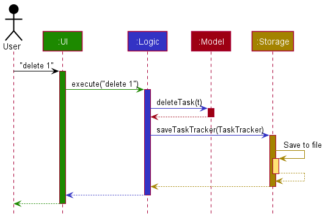

The sections below give more details of each component.

### UI component

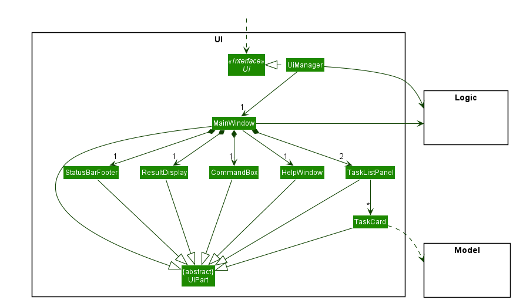

**API** :
[`Ui.java`](https://github.com/AY2021S2-CS2103-T14-4/tp/tree/master/src/main/java/seedu/address/ui/Ui.java)

The UI consists of a `MainWindow` that is made up of parts e.g.`CommandBox`, `ResultDisplay`, `TaskListPanel`, `StatusBarFooter` etc. All these, including the `MainWindow`, inherit from the abstract `UiPart` class.
There are 2 `TaskListPanel`, one for All tasks and another for Daily tasks.

The `UI` component uses JavaFx UI framework. The layout of these UI parts are defined in matching `.fxml` files that are in the `src/main/resources/view` folder. For example, the layout of the [`MainWindow`](https://github.com/AY2021S2-CS2103-T14-4/tp/tree/master/src/main/java/seedu/address/ui/MainWindow.java) is specified in [`MainWindow.fxml`](https://github.com/AY2021S2-CS2103-T14-4/tp/tree/master/src/main/resources/view/MainWindow.fxml)

The `UI` component,

* Executes user commands using the `Logic` component.
* Listens for changes to `Model` data so that the UI can be updated with the modified data.

### Logic component

**API** :
[`Logic.java`](https://github.com/AY2021S2-CS2103-T14-4/tp/tree/master/src/main/java/seedu/address/logic/Logic.java)

1. `Logic` uses the `TaskTrackerParser` class to parse the user command.
1. This results in a `Command` object which is executed by the `LogicManager`.
1. The command execution can affect the `Model` (e.g. adding a person).
1. The result of the command execution is encapsulated as a `CommandResult` object which is passed back to the `Ui`.
1. In addition, the `CommandResult` object can also instruct the `Ui` to perform certain actions, such as displaying help to the user.

Given below is the Sequence Diagram for interactions within the `Logic` component for the `execute("delete 1")` API call.

:information_source: **Note:** The lifeline for `DeleteCommand` and `DeleteCommandParser` should end at the destroy marker (X) but due to a limitation of PlantUML, the lifeline reaches the end of diagram.

### Model component

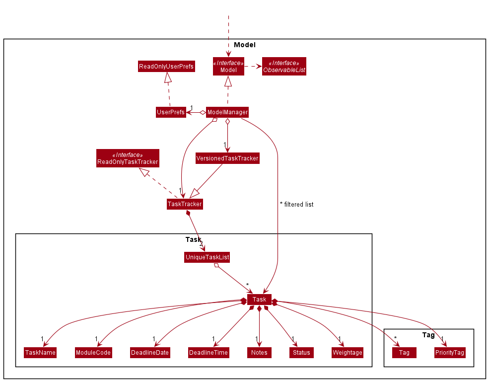

**API** : [`Model.java`](https://github.com/AY2021S2-CS2103-T14-4/tp/tree/master/src/main/java/seedu/address/model/Model.java)

The `Model`,

* stores a `UserPrefs` object that represents the user’s preferences.
* stores the task tracker data.
* exposes an unmodifiable `ObservableList<Task>` that can be 'observed' e.g. the UI can be bound to this list so that
  the UI automatically updates when the data in the list change.
* does not depend on any of the other three components.
* contains DeadlineDate, DeadlineTime, ModuleCode, Remark, Status, TaskName, Weightage classes which serve as
  attributes of the Task class
* Tasks stored have to be unique

### Storage component

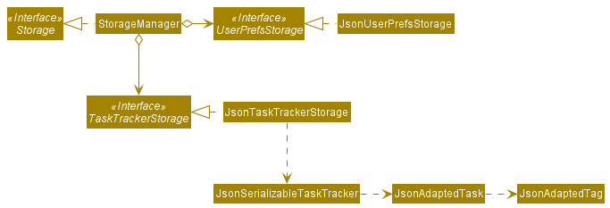

**API** : [`Storage.java`](https://github.com/AY2021S2-CS2103-T14-4/tp/tree/master/src/main/java/seedu/address/storage/Storage.java)

The `Storage` component,
* can save `UserPrefs` objects in json format and read it back.
* can save the task tracker data in json format and read it back.

### Common classes

Classes used by multiple components are in the `seedu.addressbook.commons` package.

--------------------------------------------------------------------------------------------------------------------

## **Implementation**

This section describes some noteworthy details on how certain features are implemented.

### Sorting Feature

The proposed sorting feature allows a user to sort the `TaskTracker` according to specified flags. This feature makes use of  `SortingFlag` which indicates the attribute by which `Task`s are to be sorted by. Currently, this feature supports sorting by the following attributes:

1. `dateTime` - Deadline Date & Time (Chronological order)
2. `taskName` - Task Name (Lexicographical order)
3. `moduleCode` - Module Code (Lexicographical order)
4. `priorityTag` - Priority Tag (High -> Medium -> Low)
5. `weightage` - Task weightage (descending order: highest weightage first)

The sorting operation is exposed in the `Model` interface as `Model#sortTasks(Comparator)`. The `SortingFlag` determines which type of `Comparator` is to be used for the actual sorting implementation. It is noteworthy to mention that the sorting is performed only on the `UniqueTaskList`  that is displayed on the UI; no actual sorting of JSON data is performed.

Given below is an example usage scenario and how the sorting mechanism behaves at each step.

Step 1. The user launches the application, and it is assumed that there is existing data in the `TaskTracker`. The user executes the command  `sort moduleCode` in order to sort the tasks by module code. The `sort` command creates a new SortingFlag with type `MODULE_CODE`, and creates a `ModuleCodeComparator` to be used for sorting.

Step 2. The `sort` command then calls the `Model#sortTasks(Comparator)`  method, and passes the `ModuleCodeComparator` as a parameter to be used for the sorting.

Step 3. The `Model#sortTasks(Comparator)` method then sorts the `UniqueTaskList`, and the sorted list is then reflected in the UI.

:information_source: **Note:** The lifeline for `SortCommand` & `SortCommandParser` should end at the destroy marker (X) but due to a limitation of PlantUML, the lifeline reaches the end of diagram.

### Time-based alerts

The proposed time-based alert allows a user to filter the tasks in `TaskTracker` to have
deadlines within the specified days or weeks. This feature makes use of `DeadlineDateInRangePredicate`
which filter based on the `DeadlineDate` of the task.

The filtering operation is exposed in the `Model` interface as `Model#updateFilteredTaskList(Predicate)`.
It is noteworthy to mention that the filtering is performed only on the
`UniqueTaskList`  that is displayed on the UI; no actual filtering of JSON data is performed.

Given below is an example usage scenario and how the filtering mechanism behaves at each step.

Step 1. The user launches the application, and it is assumed that there is existing data in
the `TaskTracker`. The user executes the command  `dueIn day/NUMBER_OF_DAYS` in order to filter the
tasks that have `DeadlineDate` within `NUMBER_OF_DAYS` from today. The `dueInCommandParser` creates
a new `DeadlineDateInRangePredicate` with parameter `NUMBER_OF_DAYS` to be used for filtering. The
predicate will be passed on to the `dueIn` command.

Step 2. The `dueIn` command then calls the `Model#updateFilteredTaskList(Predicate)`
method, and passes the `DeadlineDateInRangePredicate` as a parameter to be used for the filtering.

Step 3. The `Model#updateFilteredTaskList(Predicate)` method then filters the `UniqueTaskList`,
and the filtered list is then reflected in the UI.

:information_source: **Note:** The lifeline for `DueInCommand` & `DueInCommandParser` should end at the destroy marker (X) but due to a limitation of PlantUML, the lifeline reaches the end of diagram.

### Undo/redo feature

The undo/redo mechanism is facilitated by `VersionedTaskTracker`. It extends `TaskTracker` with an undo/redo history, stored internally as an `taskTrackerStateList` and `currentStatePointer`. Additionally, it implements the following operations:

* `VersionedTaskTracker#commit()` — Saves the current task tracker state in its history.
* `VersionedTaskTracker#undo()` — Restores the previous task tracker state from its history.
* `VersionedTaskTracker#redo()` — Restores a previously undone task tracker state from its history.

These operations are exposed in the `Model` interface as `Model#commitTaskTracker()`, `Model#undoTaskTracker()` and `Model#redoTaskTracker()` respectively.

Given below is an example usage scenario and how the undo/redo mechanism behaves at each step.

Step 1. The user launches the application for the first time. The `VersionedTaskTracker` will be initialized with the initial task tracker state, and the `currentStatePointer` pointing to that single task tracker state.

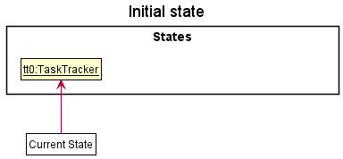

Step 2. The user executes `delete 5` command to delete the 5th task in the task tracker. The `delete` command calls `Model#commitTaskTracker()`, causing the modified state of the task tracker after the `delete 5` command executes to be saved in the `taskTrackerStateList`, and the `currentStatePointer` is shifted to the newly inserted task tracker state.

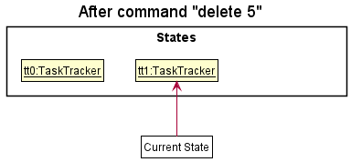

Step 3. The user executes `add tn/PE1 …​` to add a new task. The `add` command also calls `Model#commitTaskTracker()`, causing another modified task tracker state to be saved into the `taskTrackerStateList`.

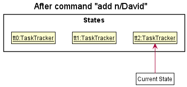

:information_source: **Note:** If a command fails its execution, it will not call `Model#commitTaskTracker()`, so the task tracker state will not be saved into the `taskTrackerStateList`.

Step 4. The user now decides that adding the task was a mistake, and decides to undo that action by executing the `undo` command. The `undo` command will call `Model#undoTaskTracker()`, which will shift the `currentStatePointer` once to the left, pointing it to the previous task tracker state, and restores the task tracker to that state.

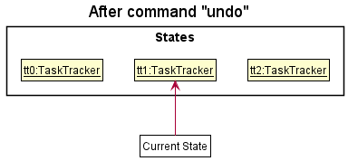

:information_source: **Note:** If the `currentStatePointer` is at index 0, pointing to the initial TaskTracker state, then there are no previous TaskTracker states to restore. The `undo` command uses `Model#canUndoTaskTracker()` to check if this is the case. If so, it will return an error to the user rather
than attempting to perform the undo.

The following sequence diagram shows how the undo operation works:

:information_source: **Note:** The lifeline for `UndoCommand` should end at the destroy marker (X) but due to a limitation of PlantUML, the lifeline reaches the end of diagram.

The `redo` command does the opposite — it calls `Model#redoTaskTracker()`, which shifts the `currentStatePointer` once to the right, pointing to the previously undone state, and restores the task tracker to that state.

:information_source: **Note:** If the `currentStatePointer` is at index `taskTrackerStateList.size() - 1`, pointing to the latest task tracker state, then there are no undone TaskTracker states to restore. The `redo` command uses `Model#canRedoTaskTracker()` to check if this is the case. If so, it will return an error to the user rather than attempting to perform the redo.

 
Step 5. The user then decides to execute the command `list`. Commands that do not modify the address book, such as `list`, will usually not call `Model#commitTaskTracker()`, `Model#undoTaskTracker()` or `Model#redoTaskTracker()`. Thus, the `taskTrackerStateList` remains unchanged.

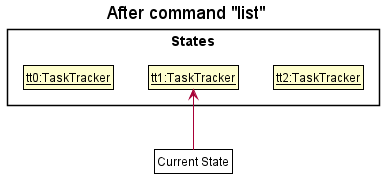

Step 6. The user executes `clear`, which calls `Model#commitTaskTracker()`. Since the `currentStatePointer` is not pointing at the end of the `taskTrackerStateList`, all address book states after the `currentStatePointer` will be purged. Reason: It no longer makes sense to redo the `add n/PE1 …​` command. This is the behavior that most modern desktop applications follow.

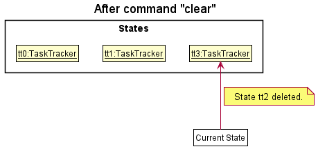

The following activity diagram summarizes what happens when a user executes a new command:

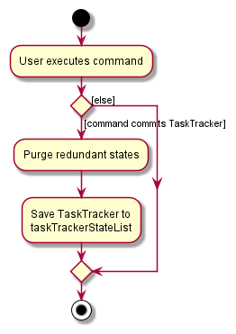

--------------------------------------------------------------------------------------------------------------------

## **Documentation, logging, testing, configuration, dev-ops**

* [Documentation guide](Documentation.md)
* [Testing guide](Testing.md)
* [Logging guide](Logging.md)
* [Configuration guide](Configuration.md)
* [DevOps guide](DevOps.md)

--------------------------------------------------------------------------------------------------------------------

## **Appendix: Requirements**

### Product scope

**Target user profile**:

* is a CS student in NUS
* has a need to consolidate and manage deadlines for CS-coded module tasks
* prefer desktop apps over other types of apps
* prefers to use CLI over a GUI
* can type fast
* prefers an all-keyboard workflow without needing to use a mouse

**Value proposition**:

- manage upcoming CS assignment deadlines faster than a typical mouse/GUI driven app
- consolidates all CS-coded module tasks into a single place for a CS student to manage and view easily
- allows a CS student to prioritise his/her time by seeing which task deadlines are more pressing
- the app can also remind a CS student about his/her upcoming deadlines so that he/she does not need to remember everything all at once
- easy CLI operation would entice a CS student to use the app, as he/she probably interacts with CLI on a daily basis while coding/doing CS-coded module tasks

### User stories

Priorities: High (must have) - `* * *`, Medium (nice to have) - `* *`, Low (unlikely to have) - `*`

| Priority | As a …​                                    | I want to …​                     | So that I can…​                                                        |
| -------- | ------------------------------------------ | ------------------------------ | ---------------------------------------------------------------------- |
| `* * *`  | new user                                   | see usage instructions         | refer to instructions when I forget how to use the App                 |
| `* * *`  | user                                       | add a new CS-coded module task                               | refer to the task in the App |
| `* * *`  | user                                       | delete a task                                                | remove entries that I no longer need                         |
| `* * *`  | user                                       | find a task by its moduleName                                      | locate a particular task in order to view its deadline and relevant details |
| `* * *`  | user                                       | add priority tags (LOW, MEDIUM, HIGH)                        | categorise my tasks and know which ones I should work on first |
| `* * *` | user | be able to sort the tasks based on different categories | see which tasks requires more attention and know which are the tasks that I should work on first |
| `* * *`  | user who has just finished a task | mark a task as done                                          | know which tasks I have completed                            |
| ` * * * ` | user | have a separate list of daily tasks that I have to do | set achievable goal to clear a selection of tasks for that day to remain productive
| `* *` | user | add notes to a particular task | jot down quick ideas or notes that I have for a particular task |
| `* *` | user with many tasks in the App | sort tasks either by deadlines, module codes, or their priority tags | have different views of the App when I require them |
| `* *` | user | edit task attributes | change the details of a task if the task requirements or details have changed |
| `* * ` | user | be able to see every tasks | know what tasks I have on hand and start to work on the tasks |
| ` * * ` | user | undo/redo a mistake when using semester.config | save time from deleting the wrong tasks, input a new tasks and checking whether the new task is correct |
| `*` | user with many upcoming deadlines | be reminded of deadlines that are approaching | remember when my tasks are due and work on them |
| `*` | user who just finished their semester | clear the application of all tasks | prepare for the next upcoming semester |

### Use cases

(For all use cases below, the **System** is the `TaskTracker` and the **Actor** is the `user`, unless specified otherwise)

**Use case: Delete a deadline**

**MSS**

1.  User requests to list deadlines
2.  TaskTracker shows a list of deadlines
3.  User requests to delete a specific deadline in the list
4.  TaskTracker deletes the deadline

    Use case ends.

**Extensions**

* 2a. The list is empty.

  Use case ends.

* 3a. The given index is invalid.

    * 3a1. TaskTracker shows an error message.

      Use case resumes at step 2.

**Use case: Edit a deadline**

1. User requests to list deadlines
2. TaskTracker shows a list of deadlines
3. User requests to edit a specific deadline in the list
4. TaskTracker updates the specific deadline in the list

    Use case ends.

**Extensions**

* 2a. The list is empty.
    Use case ends.
* 3a. The given index is invalid
    * 3a1. TaskTracker shows an error message.
        Use case resumes at step 2.
* 3b. Optional fields are not provided
    * 3b1. TaskTracker shows an error message

        Use case resumes at step 2.

**Use case: Setting a priority tag**

1. User requests to list deadlines
2. TaskTracker shows a list of deadlines**
3. User requests to set a priority tag on a specific deadline in the list
4. TaskTracker sets a priority tag to the specific deadline in the list

**Extensions**

* 2a. The list is empty.

    Use case ends.
* 3a. The given index is invalid
    * 3a1. TaskTracker shows an error message

      Use case resumes at step 2
* 3b. The given priority tag is invalid
    * 3b1. TaskTracker shows an error message

        Use case resumes at step 2

**Use case: Adding notes to a deadline**

1. User requests to list deadlines
2. TaskTracker shows a list of deadlines**
3. User requests to add a note to a specific deadline in the list
4. TaskTracker adds a note to the specific deadline in the list

**Extensions**

* 2a. The list is empty.

    Use case ends
* 3a. The given index is invalid
    * 3a1. TaskTracker shows an error message

        Use case resumes at step 2
* 3b. The deadline has existing notes
    * 3b1. TaskTracker requests for confirmation to overwrite previous notes
    * 3b2. User confirms the request to overwrite previous notes
    * 3b3. TaskTracker overwrites the previous notes with a new note

        Use case ends

*{More to be added}*

### Non-Functional Requirements

1.  Should work on any _mainstream OS_ as long as it has Java `11` or above installed.
2.  The software should be portable. So moving from one OS to other OS does not create any problem.
3.  A user with above average typing speed for regular English text (i.e. not code, not system admin commands) should be able to accomplish most of the tasks faster using commands than using the mouse.
4.  The response to any use action should become visible within 2 seconds.
5.  The source code should be open source.
6.  An application should be able to have up to 1000 deadlines.
7.  The user interface should be intuitive enough for users who are not IT-savvy.
8.  The system should work on both `32-bit` and `64-bit` environments.
9. The deadline should not contain tasks deemed offensive (terrorism, bombing, etc).
10. The application can be used **without** internet.

### Glossary

* **CS:** Computer Science
* **CS-coded module tasks:** Assignments, Quizzes, Projects, and other tasks related to CS-coded modules provided by NUS School of Computing that have deadlines for submission
* **Mainstream OS**: Windows, Linux, Unix, OS-X

--------------------------------------------------------------------------------------------------------------------

## **Appendix: Instructions for manual testing**

Given below are instructions to test the app manually.
You can follow the guide line by line for to get use to the command and features of the application.

:information_source: **Note:** These instructions only provide a starting point for testers to work on;
testers are expected to do more *exploratory* testing.

### Launch and shutdown

1. Initial launch

   1. Download the jar file and copy into an empty folder

   1. Double-click the jar file Expected: Shows the GUI with a set of sample contacts. The window size may not be optimum.

1. Saving window preferences

   1. Resize the window to an optimum size. Move the window to a different location. Close the window.

   1. Re-launch the app by double-clicking the jar file. 
       Expected: The most recent window size and location is retained.

### Saving data

1. Commands to try out before starting manual testing
    1. Making sure the data is saved correctly by using the `add` command `add mc/CS3243 n/Project 1 d/15-04-2021 t/10:00 w/10%`. 
        Expected: A new task will be added to the task list.
    1. Close to application using the command `exit`. 
        Expected: The window will be closed.
    1. Re-launch the app by double clicking on the jar file. 
        Expected: The application will be launch and the previously added task will be displayed

### Adding a task

1. Adding a task to daily task list using command `add`
    1. Prerequisites: list do not have the same identical task(s) that are used in example. 
    1. Use `add mc/CS3243 n/Project 1 d/15-04-2021 t/10:00 w/10%` to attempt to add a new task to the list. 
        Expected: A new task will be added to the task list, and will be displayed on the Ui. Status bar shows success message 
        
1. Adding a task with tag(s) using command `add`
    1. Prerequisites: list do not have the same identical task(s) that are used in example. 
    1. Use `add mc/CS2102 n/Assignment 1 d/10-06-2021 t/10:00 w/8% pt/URGENT` to attempt to add a new task to the list. 
        Expected: A new task will be added to the task list, and will be displayed on the Ui with the tag `URGENT`. Status bar shows success message
    1. Use `add mc/CS2105 n/Assignment 2 d/15-06-2021 t/10:00 w/30% pt/URGENT pt/CORE` to attemp to add a new task with multiple tags to the list. 
        Expected: A new task will be added to the task list, and will be displayed on the Ui with the tag `URGENT`, `CORE`. Status bar shows success message
        
 1. Adding a task with priority tag using command `add`
    1. Prerequisites: list do not have the same identical task(s) that are used in example. 
    1. By default, if there are no user input to specify a task priority tag on `add`, priority tag will be set to default `LOW`.
    1. Use `add mc/CS2103 n/Finals d/10-03-2021 t/12:00 w/35% ptag/MEDIUM` to attempt to add a new task with priority tag `MEDIUM` to the list. 
        Expected: Expected: A new task will be added to the task list, and will be displayed on the Ui with the priority tag `MEDIUM`. Status bar shows success message
    1. Use `add mc/CS3240 n/Finals d/12-04-2021 t/16:00 w/20% pt/URGENT ptag/HIGH` to attempt to add a new task with priority tag `MEDIUM` to the list. 
        Expected: Expected: A new task will be added to the task list, and will be displayed on the Ui with the priority tag `HIGH`, tag `URGENT`. Status bar shows success message
        
### Editing a task 

### Deleting a task

1. Deleting a person while all persons are being shown

   1. Prerequisites: List all task(s) using the `list` command. Have at least 1 task(s) in the list.

   1. Test case: `delete 1` 
      Expected: First contact is deleted from the list. Details of the deleted task shown in the status message. Timestamp in the status bar is updated.

   1. Test case: `delete 0` 
      Expected: No task is deleted. Error details shown in the status message. Status bar remains the same.

   1. Other incorrect delete commands to try: `delete`, `delete x`, `...` (where x is larger than the list size) 
      Expected: Similar to previous.

## **Appendix: Effort**

Given below are the difficulty level, challenges faced, effort required, and achievements of the project.

### Difficulties 
1. Implementing `Daily task list` feature
    * This feature proved challenging to implement, as it required an additional UniqueTaskList to be added to the TaskTracker, along with the relevant methods required to update it. Furthermore, we needed to take into account the modification of tasks on the All tasks list, and propagate any updates to the dailyTaskList.
2. Implementing the color coded feature for `Priority Tag` feature
    * Despite being a seemingly simple feature, colour coding the priority tags proved to be more complicated than we initially assumed it to be. It required the styleProperty of the priority tag component in the UI to be bound to its State, and to be dynamically updated when the priority tag values were updated by the user. Nonetheless, it was an interesting feature that allowed me to learn how to dynamically bind and generate elements using JavaFX.
3. Implementing `undo` feature
    * It was difficult to implment the functionality where only commands which altered the application could be undone as there was no way to differentiate between state modifying commands and non-state modifying commands. This was overcome by creating a NonModifyingCommand Enum to differentiate between the commands as well as overriding the toString() methods of each Command such that they could be checked against the NonModifyingCommand Enum.
4. Implementing `Priority Tag` feature 
    * It was difficult to implement the priority tag feature as we have to take note of the feature ability to be sorted, to handle that issue. We introduced states as an attribute to the priority tag class, and assign values to each of those states such that it was easier to implement the comparator feature this way. 
5. 4-man team instead of 5-man 
    * While other groups have an additional group member, our team has only 1 group members due to unforseeable reasons. This caused us to be behind from most groups initially. However, we did not let the set back affect us and we actively helped each other in our components, we achieved all the deliverables since the first week of submission for the tP and did not receive any complains from the Professor or the TA. 

### Effort required
1. While the Professor and tutor recommended one meeting per week for all the deliverables for the tP, our team went beyond the recommendation and usually meet up 2-3 times a week with an average of 1.5hrs to 2hrs session each. 
2. During the meeting, we vetted each other's work line by line and recommend the best practice to each other in a professional manner. 
3. We also go beyond our own components and reach out to each other if the other team mate require assistance. 
4. Despite being 1 man down, the team managed to submit all the deliverables since the first version and met all the requirements. 

### Achievements of the Project 
1. Successfully allowed semester.config to be used by CS students (our target group) for planning of their CS coded modules.
2. Allowed up to at least 1000 tasks to be stored in semester.config, with all the features working.
3. Successfully implemented two tasks list - a general tasks list and a daily task list for students to better organise their schedule and workload.
4. Successfully implemented a working Ui that allows CS students to easily organise their tasks.
5. Successfully implemented a sorting feature that can sort tasks according to most of their attributes.
