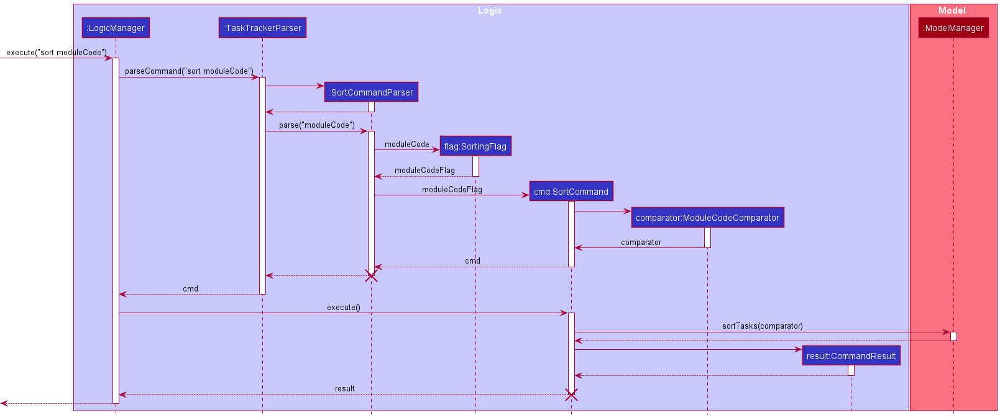

# Overview

**semester.config is a desktop application for managing your tasks.**
While it has a GUI, most of the user interactions happen using a CLI (Command Line Interface).

# Summary Of Contributions

## Code Contributed
You can see my contribution [here](https://nus-cs2103-ay2021s2.github.io/tp-dashboard/?search=&sort=groupTitle&sortWithin=title&since=&timeframe=commit&mergegroup=&groupSelect=groupByRepos&breakdown=false&tabOpen=true&tabType=authorship&tabAuthor=austenjs&tabRepo=AY2021S2-CS2103-T14-4%2Ftp%5Bmaster%5D&authorshipIsMergeGroup=false&authorshipFileTypes=docs~functional-code~test-code&authorshipIsBinaryFileTypeChecked=false).

## Enhancements implemented  
I implemented 3 main features:
1. `DeadlineDate`,`DeadlineTime`, and `Status` attributes for Task which will be useful for users;
2. `done` command to indicate a task in all tasks list to be done; and,
3. dueIn command will filter tasks that are due within a certain number of days using `DeadlineDateInRangePredicate`.

**Enhancement 1**  
* What it does: Allows the user to add, edit, and sort the Task based on these attributes.
* Justification: Most assignments have a submission date and time. `DeadlineDate` and `DeadlineTime`
helps to encapsulate these data inside the `Task` class.
Moreover, the `Status` attribute help to distinguish finished and unfinished tasks.
* Highlights :
The difficult part is implementing the DeadlineDate. As there are various formats and types of
inputs that the user gave, there must be many layer of protection in order to prevent error. For
instance, the DeadlineDate parser will first protect creating a DeadlineDate with invalid format
(the valid format in this application is `dd-MM-yyyy`). After the protection of DeadlineDate parser,
in the DeadlineDate class itself will be another layer of protection for invalid date (`29-02-2021`
for instance).

**Enhancement 2**  
* What it does: Allows the user to toggle the status of `Task` to be finished or unfinished.
* Justification: If the user wrongly mark a `Task` as done, the toggling effect of `Done` command
prevent user of having to use `Edit` command.
* Highlights:
The difficult part is updating the TaskTracker. Using side effect (switching
the boolean inside the `Status` class instead of creating a new one) breaks the application. Hence,
I ensure of using functional programming (not modifying but rather creating new object) to ensure
the application works properly.

**Enhancement 3**  
* What it does: Filters tasks that have deadlines within certain number of days/weeks.
* Justification: Some users might want to check what assignments are due within a certain number of days.
For instance, in a typical semester, every Monday denotes the beginning of new week and user wanna
check the upcoming deadlines for this week.
* Highlights:
The difficult part is ensuring the validity of `DeadlineDateInRangePredicate`. It doesn't
make sense to have deadline before today. Moreover, there might be multiple arguments given by the users.
Hence, testing must be done rigorously and covered most of the paths possible in the dueIn command.

## Contributions to the UG
* I am the one who initially refactored the UG (removing the 'AddressBook' and change with 'TaskList',
change the name of attributes used, etc).
* Added `dueIn` and `done` command to list of features.

## Contributions to the DG
* I am the one who initially refactored the DG (removing the 'AddressBook' and change with 'TaskList',
modify the existing UML diagrams, updating PUMLs)
* Adding `dueIn` section of the DG.
* In charge of NFRs.
* In charge of UI component.
* In charge of creating and verifying all UML diagrams.

## Contributions to team-based tasks

* I usually created a new Google docs for every team meeting.
* I am the one who mostly merged pull requests, and I'll inform my teammates if their PRs failed the CI or testing.
* I tried to fulfill the tP progress dashboard before the tutorial's deadline (closing issues
that haven't been done and creating new milestones).
* Add tests for :
    * `XYZCommandParsers` which increases code coverage by 6%
    * `seedu.address.common` functions
    * `DeadlineDate`,`DeadlineTime`, and `Status` attributes
* Released JAR file for V1.3.
* During PE-D, reported 22 bugs. 6 are considered `Medium` or `High` as they are unhandled exceptions.

## Contributions beyond the project team
I asked several questions on the forum which might helped other who have similar questions.

# Contributions to the Developer Guide (Extracts)
I draw 2 UML diagrams from scratch.

**`dueIn` activity diagram**

**`sort` activity diagram**

