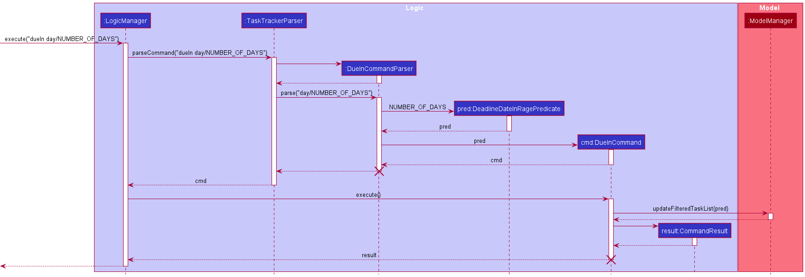
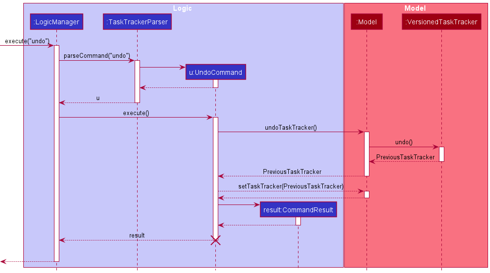

**semester.config is a desktop application for managing your tasks.**
While it has a GUI, most of the user interactions happen using a CLI (Command Line Interface).
## Summary Of Contributions
### Code Contributed
You can see my contribution [here](https://nus-cs2103-ay2021s2.github.io/tp-dashboard/?search=&sort=groupTitle&sortWithin=title&since=&timeframe=commit&mergegroup=&groupSelect=groupByRepos&breakdown=false&tabOpen=true&tabType=authorship&tabAuthor=austenjs&tabRepo=AY2021S2-CS2103-T14-4%2Ftp%5Bmaster%5D&authorshipIsMergeGroup=false&authorshipFileTypes=docs~functional-code~test-code&authorshipIsBinaryFileTypeChecked=false).
### Enhancements implemented
I implemented 3 main features:
1. `DeadlineDate`,`DeadlineTime`, and `Status` attributes for Task which will be useful for users;
2. `done` command to indicate a task in all tasks list to be done; and,
3. `dueIn` command will filter tasks that are due within a certain number of days using `DeadlineDateInRangePredicate`.

**Enhancement 1: `DeadlineDate`,`DeadlineTime`, and `Status` attributes**
* What it does: Allows the user to add, edit, and sort the Task based on these attributes.
* Justification: Useful for `sort` and `dueIn` commands.
* Highlights :
The `DeadlineDate` ensures date that are not earlier than today's date as well as
valid date (for instance 29-02-2021 will be rejected) using the help
of `java.time.LocalDate`.

**Enhancement 2: `done` command**
* What it does: Allows the user to toggle the status of `Task` to be finished or unfinished.
* Justification: If the user wrongly mark a `Task` as done, the toggling effect of `Done` command
prevent user of having to use `Edit` command.
* Highlights:
The toggle of `Status` class use functional programming paradigm(not modifying current object, but rather creating new object) to
prevent side effects.

**Enhancement 3: `dueIn` command**
* What it does: Filters tasks that have deadlines within certain number of days/weeks.
* Justification: Some users might want to check assignments within a certain day/week.
* Highlights: Using the command without specifying params will automatically list tasks within
the next 7 days.
### Contributions to the UG
* I am the one who initially refactored the UG (removing the 'AddressBook' and change with 'TaskList',
change the name of attributes used, etc).
* Added `dueIn` and `done` command to list of features.
### Contributions to the DG
* I am the one who initially refactored the DG (removing the 'AddressBook' and change with 'TaskList',
modify the existing UML diagrams, updating PUMLs)
* Adding `dueIn` section of the DG.
* In charge of NFRs.
* In charge of UI component.
* In charge of creating and verifying all UML diagrams.
### Contributions to team-based tasks
* I usually created a new Google docs for every team meeting.
* I am the one who mostly merged pull requests, and I'll inform my teammates if their PRs failed the CI or testing.
* I tried to fulfill the tP progress dashboard before the tutorial's deadline (closing issues
that haven't been done and creating new milestones).
* Add tests for :
    * `XYZCommandParsers` which increases code coverage by 6%
    * `seedu.address.common` functions
    * `DeadlineDate`,`DeadlineTime`, and `Status` attributes
* Released JAR file for V1.3.
* During PE-D, reported 22 bugs. 6 are considered `Medium` or `High` as they are unhandled exceptions.
### Contributions beyond the project team
I asked several questions on the forum which might helped other who have similar questions.

## Contributions to the Developer Guide (Extracts)
I drew 2 UML diagrams from scratch. These are:

**`dueIn` sequence diagram**

**`sort` sequence diagram**

I also updated all the UML diagrams given by AddressBook3. Most notable ones are:

**`undo` sequence diagram**

**`Model` class diagram**

